# FinSight - Financial Predictive Analytics Platform

<p align="center">
  <strong>From raw banking data to decision-ready AI insights in one Streamlit experience.</strong>
</p>

<p align="center">
  
  
  
  
  
</p>

---

## 1. Overview

FinSight is an end-to-end financial analytics project that unifies prediction, forecasting, anomaly detection, explainability, and dashboard storytelling. It addresses a common hackathon problem: many strong models but no integrated product view for decision-makers. This platform turns model outputs into practical business intelligence through interactive workflows. It is designed for hackathon judges, data science teams, financial analysts, and product stakeholders.

---

## 2. Why This Project Stands Out

- One platform, multiple financial AI capabilities.
- Interactive product-style experience (not just notebooks).
- Explainability and drift signals included, not treated as afterthoughts.
- Includes both single prediction and batch scoring workflows.
- Export-ready reporting for executive communication.

---

## 3. Architecture (Hackathon Flow)

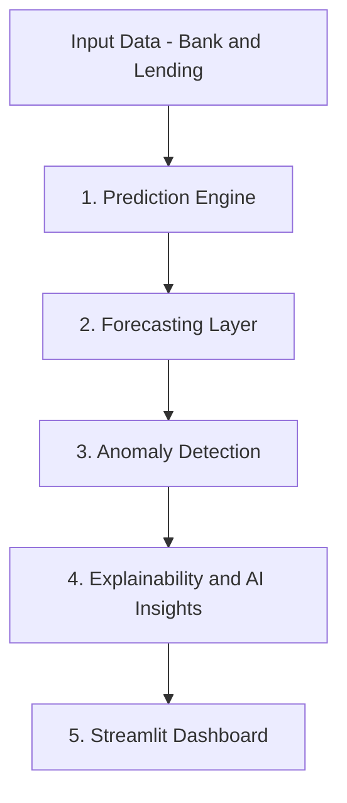

### Runtime Architecture

- UI Layer: Streamlit app in `dashboard/app.py`.
- Domain Logic Layer: Reusable modules in `src/`.
- Model Layer: Pretrained artifacts in `models/`.
- Data Layer: CSV inputs from `data/`, with synthetic fallback support.

---

## 4. Features (Implemented and Working)

- Loan Default Risk prediction with probability and risk interpretation.
- Borrower Churn prediction after repayment behavior.
- Loan Volume forecasting with historical trend and 3-month outlook.
- Credit Demand forecasting by grade (A to E) with comparative visuals.
- Portfolio Intelligence Hub:
  - Stress testing scenarios.
  - Batch portfolio scoring.
  - Explainability (global and local).
  - Drift monitoring.
  - Executive report export.
- Bank Deposit AI:
  - Multi-model training and leaderboard.
  - Interactive customer subscription prediction.
  - Retraining on uploaded campaign data.
- Deposit Anomaly Detection:
  - Hybrid anomaly scoring.
  - Live transaction scan.
  - Batch anomaly scoring and export.

---

## 5. How Each Tab Works

This section explains exactly what happens inside each tab, including input, model logic, and output.

### Tab 1: Loan Default Risk

Purpose:
Predict default probability for a borrower.

How it works:
1. User enters borrower and loan details.
2. Input is converted to model-ready features.
3. XGBoost default model returns probability.
4. Dashboard maps probability to risk labels (low/medium/high).
5. User sees probability, threshold, and final decision guidance.

Business value:
Supports credit risk triage and pricing decisions.

### Tab 2: Borrower Churn

Purpose:
Estimate if a borrower is unlikely to return for another loan.

How it works:
1. User provides customer and loan behavior attributes.
2. Features are encoded and aligned to training schema.
3. XGBoost churn model predicts churn probability.
4. UI returns churn risk and retained/churned interpretation.

Business value:
Enables retention strategies and campaign prioritization.

### Tab 3: Loan Volume Forecast

Purpose:
Forecast monthly lending volume.

How it works:
1. App loads historical monthly series from processed data.
2. Performance comparison is shown across baseline models.
3. Forecast table displays next 3-month estimate and bounds.
4. Historical line chart helps detect trend shifts.

Business value:
Useful for planning capital allocation and operations staffing.

### Tab 4: Credit Demand by Grade

Purpose:
Forecast demand split by credit grade (A to E).

How it works:
1. App loads grade-level monthly demand history.
2. User selects grades to visualize.
3. Demand trends and heatmaps reveal seasonality and segment behavior.
4. Comparative MAPE table highlights best model per grade.

Business value:
Improves portfolio balancing across risk bands.

### Tab 5: Portfolio Intelligence Hub

Purpose:
Provide portfolio-level intelligence in one control center.

How it works:
1. Stress testing adjusts baseline profile under shocks (rate, income, DTI).
2. Batch scorer processes uploaded CSV and computes default/churn/risk band.
3. Explainability ranks global and local feature impacts.
4. Drift monitor compares current vs baseline feature distribution.
5. Executive report generator exports a markdown risk brief.

Business value:
Supports risk committees, governance reviews, and scenario planning.

### Tab 6: Bank Deposit AI

Purpose:
Predict term-deposit subscription likelihood and optimize outreach.

How it works:
1. Dataset loads from default source or user upload.
2. Models are trained/evaluated (LogReg, Decision Tree, Random Forest).
3. Leaderboard displays accuracy, precision, recall, and F1.
4. User fills campaign profile form and selects model.
5. Output includes subscription probability and top feature importance.

Business value:
Improves campaign targeting and conversion efficiency.

### Tab 7: Deposit Anomaly

Purpose:
Detect suspicious transaction patterns.

How it works:
1. Hybrid anomaly engine combines Isolation Forest and reconstruction error.
2. Live scan scores single transactions with reasons.
3. Batch scanner scores uploaded files and flags anomalous records.
4. Risk trend chart tracks anomaly score movement over time.

Business value:
Early warning for fraud and unusual behavior patterns.

---

## 6. Visual Evidence (Model Outputs)

### Default Risk Diagnostics

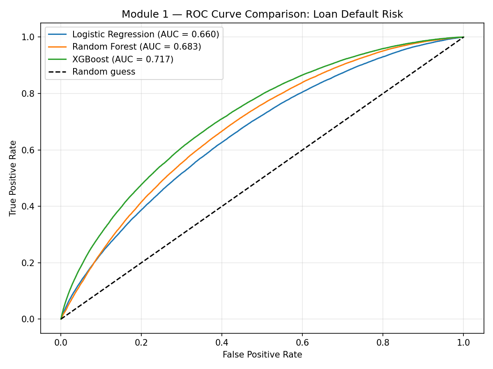
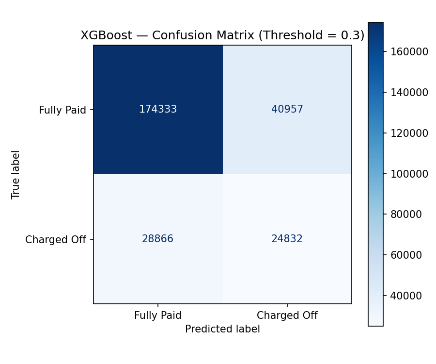
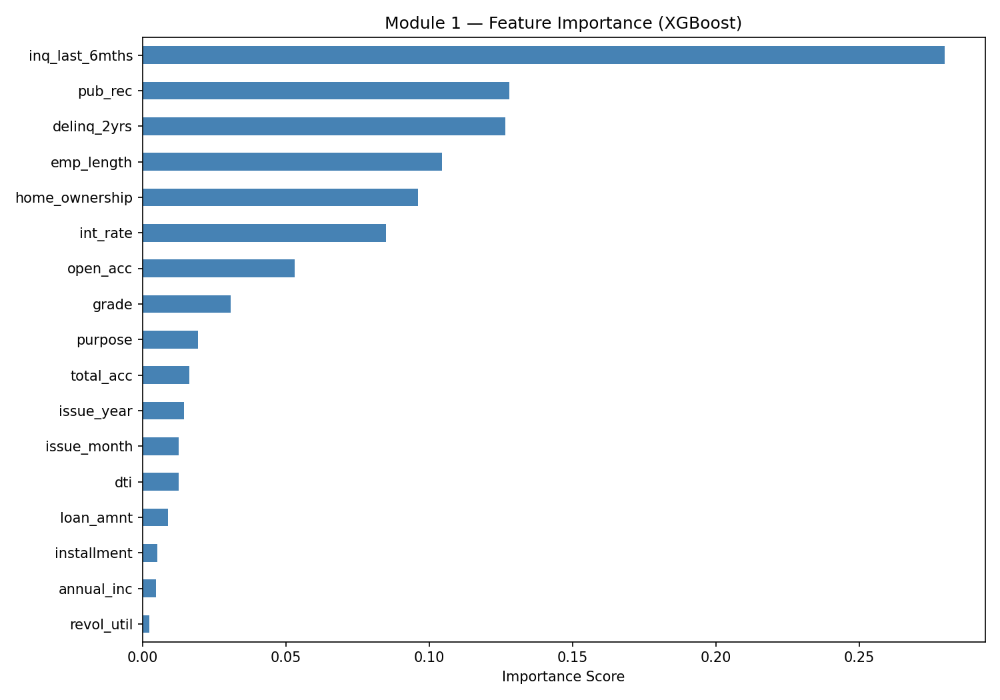

### Churn Diagnostics

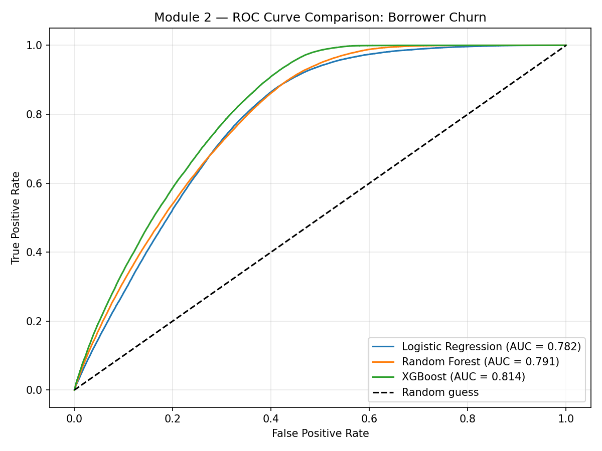
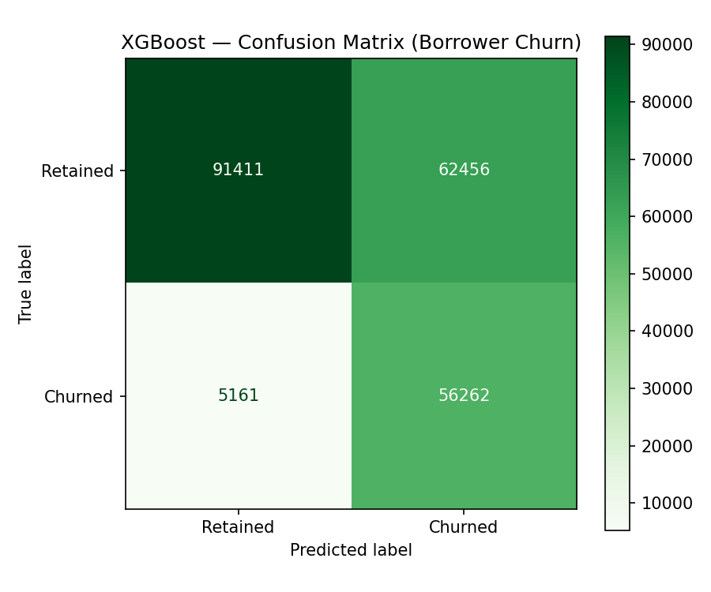
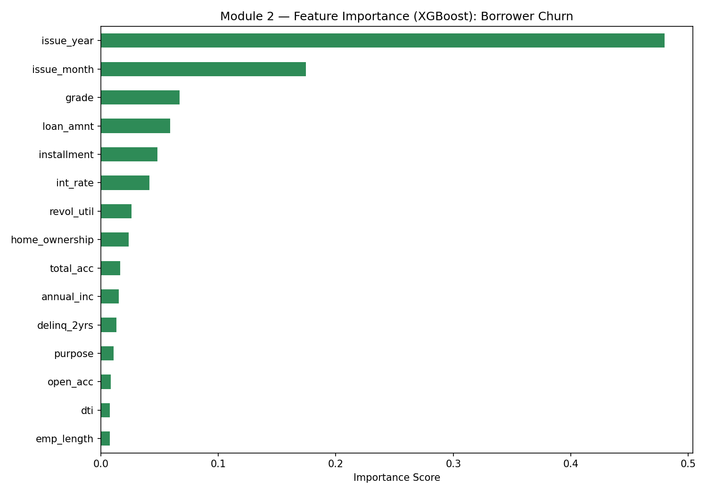

### Forecasting Results

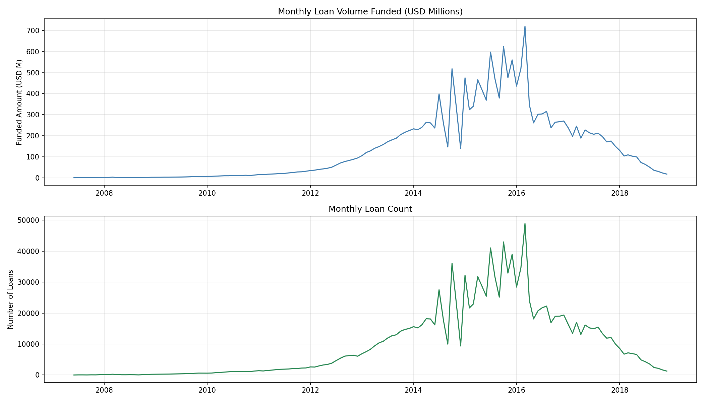
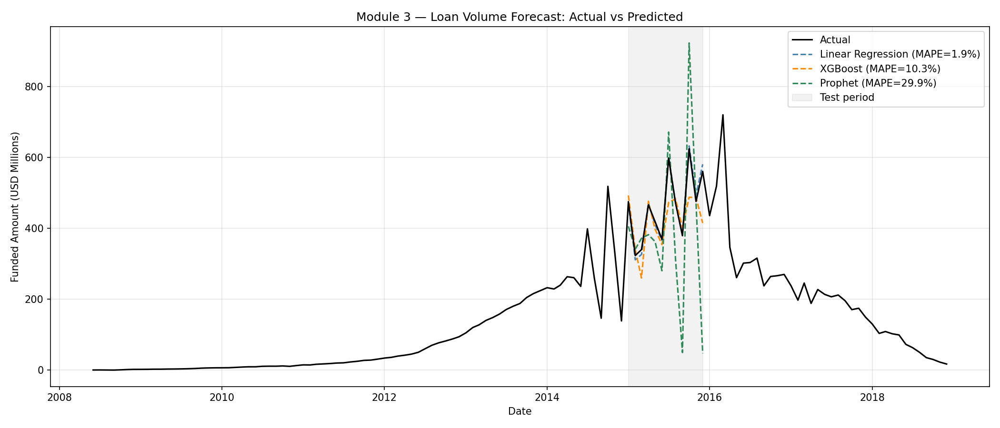
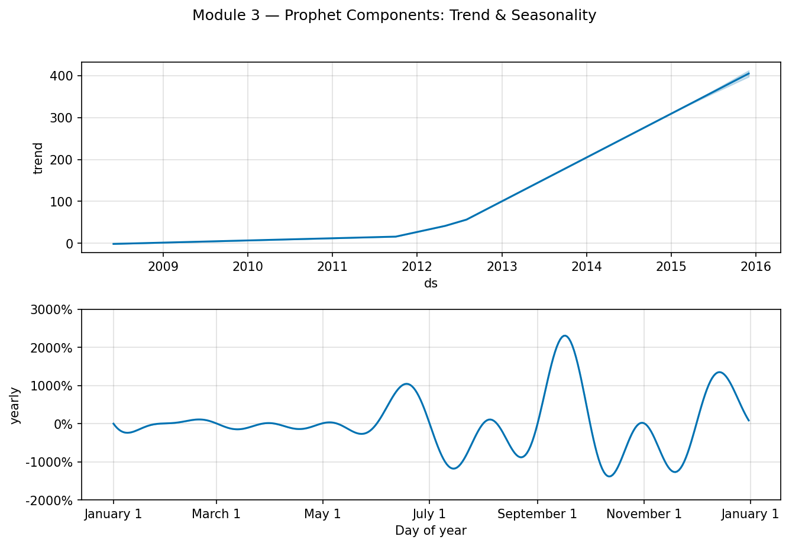

### Grade Demand Results

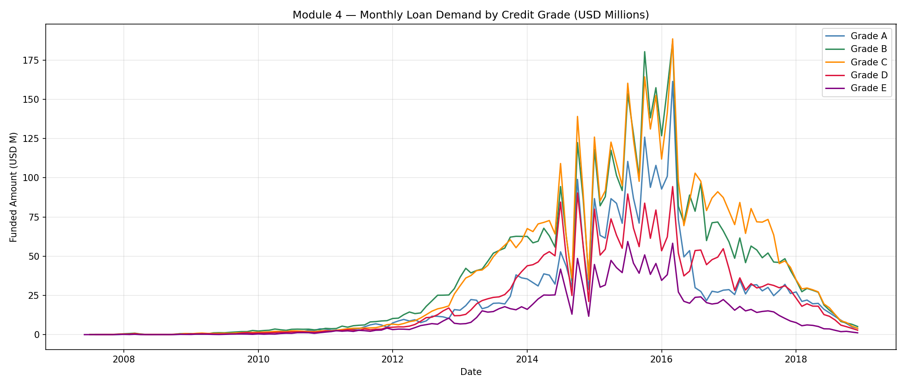
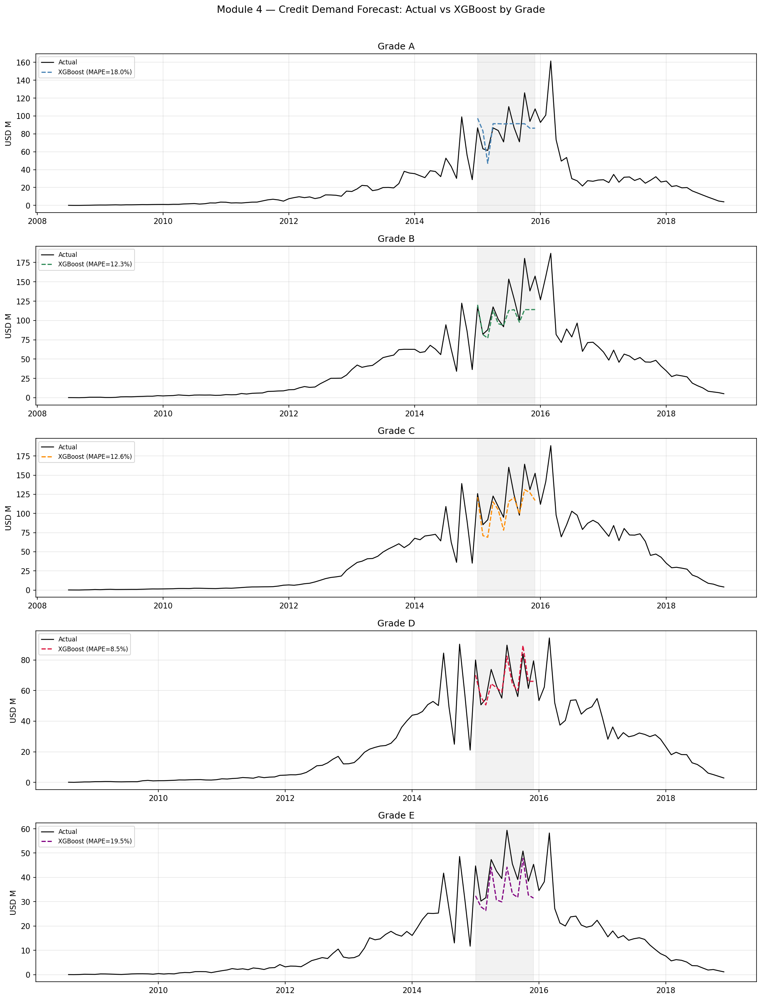
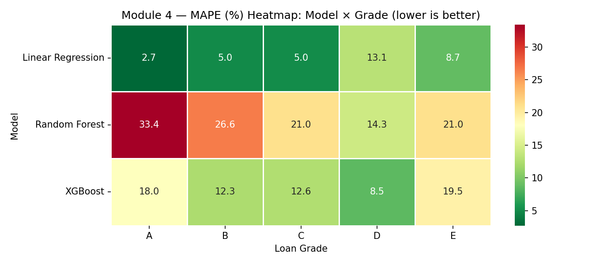

---

## 7. Project Structure

```text
Financial_Predictive_Analytics/
|- dashboard/
|  |- app.py
|- src/
|  |- data_pipeline.py
|  |- hackathon_utils.py
|  |- bank_term_deposit_module.py
|  |- bank_anomaly_module.py
|- models/
|- data/
|  |- external/
|  |- raw/
|  |- processed/
|- reports/
|- tests/
|- requirements.txt
```

---

## 8. Install and Run

### Prerequisites

- Python 3.10 to 3.12
- Git

### Step 1: Clone

```bash
git clone https://github.com/dalaldia5/Financial_Predictive_Analytics.git
cd Financial_Predictive_Analytics
```

### Step 2: Virtual Environment

Windows PowerShell:

```powershell
py -3.12 -m venv .venv
.\.venv\Scripts\Activate.ps1
```

macOS/Linux:

```bash
python3 -m venv .venv
source .venv/bin/activate
```

### Step 3: Install Dependencies

```bash
pip install -r requirements.txt
```

Windows fallback for long-path/Jupyter install issues:

```powershell
Get-Content requirements.txt | Where-Object { $_ -notmatch '^(jupyter|ipykernel)==' } | Set-Content requirements.runtime.txt
pip install -r requirements.runtime.txt
```

### Step 4: Optional Data Pipeline

Place this file in `data/raw/`:

- accepted_2007_to_2018Q4.csv

Run pipeline:

```bash
python src/data_pipeline.py
```

### Step 5: Launch Dashboard

```bash
streamlit run dashboard/app.py
```

If port 8501 is occupied:

```bash
streamlit run dashboard/app.py --server.port 8502
```

---

## 9. Usage Examples

### A. Single Prediction Flow

1. Open Tab 1 or Tab 2.
2. Fill in profile fields.
3. Click predict.
4. Read probability and decision signal.

### B. Batch Portfolio Scoring

1. Open Tab 5.
2. Download sample CSV template.
3. Upload populated CSV.
4. Review risk columns and export scored output.

### C. Batch Anomaly Scoring

1. Open Tab 7.
2. Upload transaction CSV with required columns.
3. Review flagged share and risk labels.
4. Download scored anomaly batch.

---

## 10. Tech Stack

- Language: Python
- App: Streamlit
- Data: pandas, NumPy
- ML: scikit-learn, XGBoost, imbalanced-learn
- Forecasting: Prophet
- Visualization: Matplotlib, seaborn
- Persistence: joblib
- Optional AI text generation: OpenAI API key (if configured)

---

## 11. Testing

Existing tests cover helper utilities for stress, bank-deposit workflows, and anomaly scoring.

```bash
pytest -q
```

---

## 12. Limitations

- Some visuals depend on local processed files and model artifacts.
- Notebook dependencies can fail on Windows without long-path support.
- No production API layer or auth layer yet.
- Metrics are dependent on available dataset versions and preprocessing assumptions.

---

## 13. Future Improvements

- Add experiment tracking and model version registry.
- Add CI pipeline for automated validation and report generation.
- Expose inference endpoints via FastAPI.
- Add role-based access and audit logs.
- Add automated drift alerts and retraining triggers.

---

## 14. Team and Credits

- Dataset source: Lending Club public loan data (Kaggle workflow).
- Built as a portfolio + hackathon-ready analytics product.

If this project helps you, consider starring the repository and sharing feedback.
