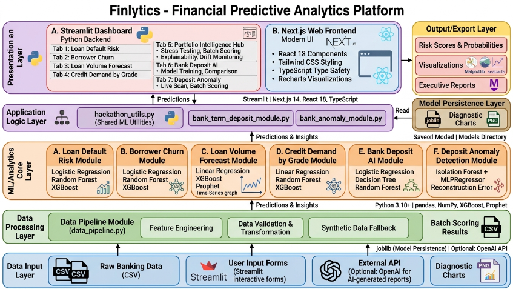
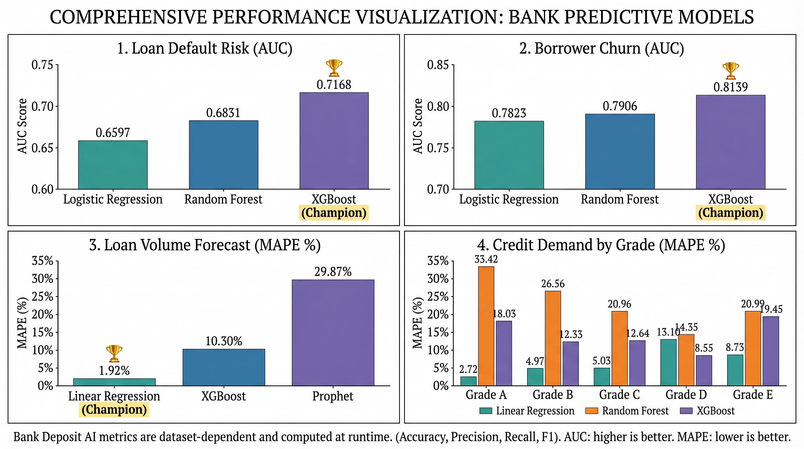

# Finlytics - Financial Predictive Analytics

## NatWest Code for Purpose Hackathon 2026

**Team Name:** CodeX\_

**Team Members**

1. Dia Dalal
2. Neelima Singh
3. Devanshi Goyal
4. Mehak Taneja

<p align="center">
  <strong>From raw banking data to decision-ready AI insights in one Streamlit experience.</strong>
</p>

<p align="center">
  
  
  
  
</p>

> [!IMPORTANT]
> Demo Video: Embedded-style preview (click to play on YouTube).

<p align="center">
  <a href="https://www.youtube.com/watch?v=rIvNy6mU9sA">
    
  </a>
  <br />
  <a href="https://www.youtube.com/watch?v=rIvNy6mU9sA">
    
  </a>
</p>

---

## 1. Overview

Imagine a small lending company where one person checks default risk in Excel, another tracks churn in a notebook, and another watches suspicious deposits in a separate tool. Every decision is slow because information is scattered. Finlytics solves this simple problem: **bring all key financial decisions into one easy dashboard** so teams can act faster and with more confidence. People use it because it saves time, reduces guesswork, and turns raw model outputs into clear actions they can understand—even if they are not ML experts.

## Intended Users

- Credit Risk Analysts and Underwriters who need faster default-risk decisions.
- Portfolio Managers and Risk Committees who review overall portfolio health and stress scenarios.
- Marketing and Retention Teams who need churn signals and deposit-campaign targeting.
- Operations Managers who plan staffing and capacity from loan-volume forecasts.
- Fraud and Compliance Teams who monitor anomalous deposit behavior.
- Product, Data, and Analytics Teams who compare model behavior and explainability outputs.

---

## 2. Why This Project Stands Out

- One platform, multiple financial AI capabilities.
- Interactive product-style experience (not just notebooks).
- Explainability and drift signals included, not treated as afterthoughts.
- Includes both single prediction and batch scoring workflows.
- Export-ready reporting for executive communication.

---

## 3. Architecture

<p align="center">
  
</p>

### Runtime Architecture

- UI Layer: Streamlit app in `dashboard/app.py`.
- Domain Logic Layer: Reusable modules in `src/`.
- Model Layer: Pretrained artifacts in `models/`.
- Data Layer: CSV inputs from `data/`, with synthetic fallback support.

---

## 4. Features (Implemented and Working)

- Loan Default Risk - predict default probability for any borrower.
- Borrower Churn - estimate if a customer is unlikely to return.
- Loan Volume Forecast - 3-month outlook of total lending activity.
- Credit Demand by Grade - demand forecasting split by borrower grade (A-E).
- Explainable AI (XAI) Integration:
  - SHAP waterfall plots provide local interpretability for single predictions.
  - Analysts can see exactly which features increased or decreased an individual risk score.
  - Supports transparent, audit-ready decisioning aligned with fintech trust requirements.
- Bank Deposit AI:
  - Train and compare multiple models on campaign data.
  - Predict term-deposit subscription likelihood.
  - Retrain on newly uploaded datasets.
- Deposit Anomaly Detection:
  - Hybrid scoring using Isolation Forest + reconstruction error.
  - Live single-transaction scan with reason hints.
  - Batch anomaly scoring with downloadable results.
- Wealth Persona Intelligence
  - AI-driven customer segmentation using RFM analysis and K-Means clustering.
  - Generates personas (e.g., Mid-Tier Savers, Low-Activity Accounts, Frequent Transactors) and provides insights.
  - Identifies high-value “vital few” customers and detects behavioral anomalies with explanations.
  - Enables personalized targeting, better engagement, and improved retention.
---

## 4.1 Models Used and Comparison Tables

### Model inventory by module

| Module                 | Problem Type                   | Models Used                                            |
| ---------------------- | ------------------------------ | ------------------------------------------------------ |
| Loan Default Risk      | Binary classification          | Logistic Regression, Random Forest, XGBoost            |
| Borrower Churn         | Binary classification          | Logistic Regression, Random Forest, XGBoost            |
| Loan Volume Forecast   | Time-series regression         | Linear Regression, XGBoost, Prophet                    |
| Credit Demand by Grade | Grade-wise regression          | Linear Regression, Random Forest, XGBoost              |
| Bank Deposit AI        | Binary classification          | Logistic Regression, Decision Tree, Random Forest      |
| Deposit Anomaly        | Unsupervised anomaly detection | Isolation Forest + MLPRegressor (reconstruction error) |
| Wealth Persona Intelligence| Customer segmentation (unsupervised) | RFM Analysis + K-Means Clustering            |

### Performance comparison (dashboard values)

<p align="center">
  
</p>

---

## 5. How Each Tab Works

### Tab 1: Loan Default Risk

Purpose:
Predict whether a borrower is likely to default on their loan.

How it works:

1. User enters borrower details (income, loan amount, credit grade, etc.).
2. Input is processed into model-ready features.
3. XGBoost model returns a default probability score.
4. Dashboard maps the score to a risk label: Low / Medium / High.
5. User sees the probability, decision threshold, and a recommended action.
6. SHAP waterfall explains local drivers (for example DTI, income, interest rate), showing which factors pushed the borrower toward a High Risk or safer label.

Business value:
Helps credit analysts quickly triage new applications while maintaining transparency and trust, because each High Risk decision is backed by feature-level evidence.

### Tab 2: Borrower Churn

Purpose:
Find out if a borrower is unlikely to take another loan in the future.

How it works:

1. User provides customer and repayment behavior details.
2. Features are encoded and matched to the training schema.
3. XGBoost churn model outputs a churn probability.
4. UI shows whether the customer is likely to stay or churn.
5. SHAP waterfall provides local explanation of the churn score, highlighting exactly which borrower-level features increased or reduced churn risk.

Business value:
Allows marketing teams to run targeted retention campaigns with explainable rationale, improving confidence in interventions and governance reporting.

### Tab 3: Loan Volume Forecast

Purpose:
Predict how much total loan volume is expected in the next 3 months.

How it works:

1. Historical monthly loan series is loaded from processed data.
2. Multiple forecasting models are compared side by side.
3. A forecast table shows estimates and confidence bounds.
4. A trend chart helps identify growth or decline patterns.

Business value:
Helps operations teams plan staffing and capital allocation.

### Tab 4: Credit Demand by Grade

Purpose:
Forecast loan demand separately for each credit grade (A to E).

How it works:

1. Grade-level monthly demand history is loaded.
2. User selects which grades to view.
3. Demand trends and a heatmap reveal seasonality per grade.
4. MAPE comparison table shows which model works best per grade.

Business value:
Supports better portfolio balancing across risk segments.

### Tab 5: Portfolio Intelligence Hub

Purpose:
Give a complete picture of your entire loan portfolio's health in one place.

How it works:

1. Stress testing simulates scenarios like rate hikes or income drops.
2. Batch scorer processes an uploaded CSV and tags each loan with risk scores.
3. Explainability panel shows which features drive predictions globally and locally.
4. Drift monitor flags if current borrower data has shifted from the training baseline.
5. Executive report generator creates a ready-to-share Markdown summary.

Business value:
Supports risk committees, governance reviews, and scenario planning.

### Tab 6: Bank Deposit AI

Purpose:
Predict which customers are most likely to subscribe to a term deposit.

How it works:

1. Default dataset loads, or user uploads their own campaign data.
2. Three models are trained and evaluated on the data.
3. Leaderboard displays accuracy, precision, recall, and F1.
4. User enters a customer profile and picks a model.
5. Output shows subscription probability and top contributing features.
6. SHAP waterfall now explains each individual prediction so analysts can see which profile attributes pushed the customer toward likely subscribe vs low intent.

Business value:
Helps campaign teams focus outreach on high-probability customers with transparent, feature-level justification that strengthens stakeholder trust.

### Tab 7: Deposit Anomaly

Purpose:
Spot suspicious or unusual deposit transactions automatically.

How it works:

1. A hybrid engine combines Isolation Forest scores and reconstruction error.
2. Live scan lets the user check one transaction and see anomaly reasons.
3. Batch scanner scores an entire uploaded file and flags risky records.
4. A risk trend chart tracks how anomaly scores change over time.
5. SHAP waterfall on live scans shows which transaction features (for example amount, frequency, or timing) pushed the score toward suspicious classification.

### Tab 8: Wealth Persona Intelligence

Purpose:
Segment customers into meaningful personas to enable personalized engagement and better decision-making.

How it works:

1. Uses RFM analysis (Recency, Frequency, Monetary) to capture customer behavior.
2. Applies K-Means clustering to group customers into distinct personas.
3. Generates persona labels (for example: Mid-Tier Savers, Frequent Transactors, Low-Activity Users).
4. Provides insights like customer count, transaction patterns, and monetary value for each segment.
5. Identifies high-value “vital few” customers for targeted focus.
6. Highlights regional opportunities based on activity and balances.
7. Detects behavioral anomalies within segments for deeper analysis.
8. Enables teams to design personalized strategies for retention, growth, and engagement.

Business value:
Early fraud detection before losses grow, with interpretable evidence that supports faster analyst validation and stronger compliance trust.

### Use Cases

Imagine a small fintech team with three people:

- **Riya** (Risk Analyst)
- **Arjun** (Marketing Lead)
- **Sara** (Operations Manager)

They open Finlytics every morning. Here is how each tab helps them in real life:

- **Loan Default Risk** - Riya checks a new applicant before approval. If the risk is high, she suggests a smaller loan or stricter checks. "Will this borrower pay back or default?"
- **Borrower Churn** - Arjun finds customers who may not return. He targets them with retention offers. "Who might stop using us after one loan?"
- **Loan Volume Forecast** - Sara checks how much business is expected next quarter to plan staffing. "How much lending will we process next?"
- **Credit Demand by Grade** - Riya reviews demand by risk grade to balance the portfolio. "Which grade segment will grow next?"
- **Bank Deposit AI** - Arjun focuses campaign calls on customers most likely to say yes. "Who will subscribe to our deposit product?"
- **Deposit Anomaly** - Sara monitors incoming deposits and investigates flagged transactions. "Does this transaction look suspicious?"
- **Wealth Persona Intelligence** - Arjun and Sara identify high-value customer segments and tailor strategies for each persona. They focus on retaining premium users and engaging low-activity ones. "Which customer segment should we target and how?"
---

## 6. Visual Evidence (Model Outputs)

<table>
  <tr>
    <td align="center" width="50%">
      <strong>Default Risk - ROC Curve</strong><br />
      
    </td>
    <td align="center" width="50%">
      <strong>Churn - ROC Curve</strong><br />
      
    </td>
  </tr>
  <tr>
    <td align="center" width="50%">
      <strong>Loan Volume Forecast</strong><br />
      
    </td>
    <td align="center" width="50%">
      <strong>Credit Demand by Grade</strong><br />
      
    </td>
  </tr>
  
</table>

All diagnostic plots are available in the `reports/` folder.

---

## 6.1 Preview of Website

<table>
  <tr>
    <td align="center" width="50%">
      <strong>Dashboard Overview</strong><br />
      
    </td>
    <td align="center" width="50%">
      <strong>Loan Default Risk</strong><br />
      
    </td>
  </tr>
  <tr>
    <td align="center" width="50%">
      <strong>Borrower Churn</strong><br />
      
    </td>
    <td align="center" width="50%">
      <strong>Deposit Anomaly Detection</strong><br />
      
    </td>
  </tr>
</table>

---

## 7. Project Structure

```text
Finlytics/
|- dashboard/
|  |- app.py                        # Streamlit dashboard (7 tabs)
|- finlytics-frontend/              # Next.js web frontend
|  |- src/
|- src/
|  |- data_pipeline.py              # Raw data processing
|  |- hackathon_utils.py            # Shared ML utilities
|  |- bank_term_deposit_module.py   # Deposit subscription module
|  |- bank_anomaly_module.py        # Anomaly detection module
|- models/                          # Saved model artifacts
|- data/
|  |- external/                     # External reference data and images
|  |- raw/                          # Raw input CSVs
|  |- processed/                    # Processed/feature-engineered data
|- reports/                         # Diagnostic charts (PNG)
|- notebooks/                       # Exploratory notebooks
|- tests/                           # Unit tests
|- requirements.txt
|- requirements.runtime.txt
```

---

## 8. Install and Run

### Prerequisites

- Python 3.10 to 3.12
- Node.js 18+ (only for the Next.js frontend)
- Git

### Step 1: Clone

```bash
git clone https://github.com/DevanshiGoyal/Finlytics.git
cd Finlytics
```

### Step 2: Virtual Environment

Windows PowerShell:

```powershell
py -3.12 -m venv .venv
.\.venv\Scripts\Activate.ps1
```

macOS/Linux:

```bash
python3 -m venv .venv
source .venv/bin/activate
```

### Step 3: Install Dependencies

```bash
pip install -r requirements.txt
```

Windows fallback (if you hit long-path or Jupyter install issues):

```powershell
Get-Content requirements.txt | Where-Object { $_ -notmatch '^(jupyter|ipykernel)==' } | Set-Content requirements.runtime.txt
pip install -r requirements.runtime.txt
```

### Step 4: Optional - Run the Data Pipeline

If you have the Lending Club dataset, place it in `data/raw/`:

- accepted_2007_to_2018Q4.csv

Then run:

```bash
python src/data_pipeline.py
```

If you skip this step, the dashboard will use built-in synthetic data automatically.

### Step 5: Launch the Streamlit Dashboard

```bash
streamlit run dashboard/app.py
```

If port 8501 is occupied:

```bash
streamlit run dashboard/app.py --server.port 8502
```

### Step 6: Launch the Next.js Frontend (Optional)

```bash
cd finlytics-frontend
npm install
npm run dev
```

The frontend will start at http://localhost:3000.

---

## 9. Usage Examples

### A. Single Prediction

1. Open Tab 1 (Loan Default Risk) or Tab 2 (Borrower Churn).
2. Fill in the borrower profile form.
3. Click Predict.
4. Review the probability score and risk label.

### B. Batch Portfolio Scoring

1. Open Tab 5 (Portfolio Intelligence Hub).
2. Download the sample CSV template shown on the page.
3. Fill in your portfolio data and upload the file.
4. Review the risk scores per row and download the scored output.

### C. Batch Anomaly Detection

1. Open Tab 7 (Deposit Anomaly).
2. Upload a transaction CSV with the required columns.
3. Review flagged records and anomaly scores.
4. Download the labeled batch results.

---

## 10. Tech Stack

| Layer             | Technology                                     | Purpose                                                                  |
| ----------------- | ---------------------------------------------- | ------------------------------------------------------------------------ |
| Language          | Python 3.10+                                   | Core language for data processing, modeling, and backend analytics logic |
| Dashboard         | Streamlit                                      | Build and run the interactive analytics dashboard                        |
| Web Frontend      | Next.js 14, React 18, TypeScript, Tailwind CSS | Provide modern web UI for feature modules and user workflows             |
| Data              | pandas, NumPy                                  | Data wrangling, transformations, and numeric computation                 |
| ML                | scikit-learn, XGBoost, imbalanced-learn        | Classification/regression pipelines and imbalanced-data handling         |
| Forecasting       | Prophet                                        | Time-series forecasting for forward demand and volume projections        |
| Visualization     | Matplotlib, seaborn, Recharts (frontend)       | Plot diagnostics, trends, and KPI charts across backend and frontend     |
| Model Persistence | joblib                                         | Save and load trained model artifacts efficiently                        |
| Optional          | OpenAI API (for AI-generated report text)      | Generate narrative summary text for executive-style reporting            |

---

## Tech Stack by Module

| Module                    | ML Models                          | Explainability      | Key Libraries/Tools       |
|---------------------------|------------------------------------|---------------------|---------------------------|
| Loan Default Risk   | XGBoost (champ), RF, LR           | SHAP waterfall      | scikit-learn, joblib, pandas |
| Borrower Churn      | XGBoost, RF, LR                   | SHAP waterfall      | scikit-learn, joblib      |
| Loan Vol Forecast   | Prophet, XGBoost, LR              | MAPE backtest       | prophet, pandas           |
| Credit Demand/Grade | XGBoost/RF/LR per grade (A-E)     | Heatmaps/trends     | scikit-learn, matplotlib  |
| Portfolio Hub       | All above (batch)                 | Global/local SHAP   | pandas, numpy             |
| Bank Deposit AI     | LR, Decision Tree, RF             | Feature importance  | scikit-learn              |
| Deposit Anomaly     | Isolation Forest + MLP recon err  | Reason hints        | scikit-learn              |


---

## 11. Testing

Unit tests cover core utility functions for stress testing, deposit prediction, and anomaly scoring.

```bash
pytest -q
```

---

## 12. Team and Credits

- Dataset source: Lending Club public loan data (Kaggle).
- Team: CodeX\_

---

## 13. Future Improvements

1. Add continuous model monitoring for drift, calibration, and data quality checks.
2. Automate retraining pipelines with scheduled jobs and versioned model releases.
3. Expand explainability with deeper local narratives and counterfactual insights.
4. Add one-click export for executive decks (PDF/PPT) and stakeholder summaries.

---

## 14. Environment Variables

| Variable                 | Required | Example               | Purpose                                    |
| ------------------------ | -------- | --------------------- | ------------------------------------------ |
| GEMINI_API_KEY           | Optional | your_gemini_api_key   | Enables Ask Finlytics AI responses         |
| NEXT_PUBLIC_API_BASE_URL | Optional | http://localhost:3000 | Overrides frontend API base URL            |
| FINLYTICS_PYTHON         | Optional | C:/path/to/python.exe | Forces Python interpreter for model Bridge |

---

## 15. License

This project is released under the Apache License 2.0 in compliance with the NatWest Code for Purpose Hackathon requirements.

---

## 16. Authors

| Name           | GitHub           |
| -------------- | ---------------- |
| Dia Dalal      | @dalaldia5       |
| Neelima Singh  | @neelima-singh07 |
| Devanshi Goyal | @DevanshiGoyal   |
| Mehak Taneja   | @mehak2807       |
